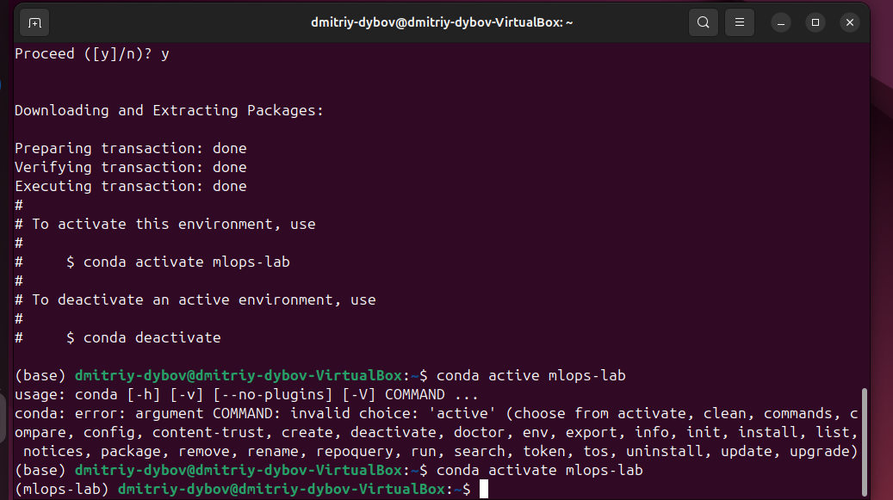
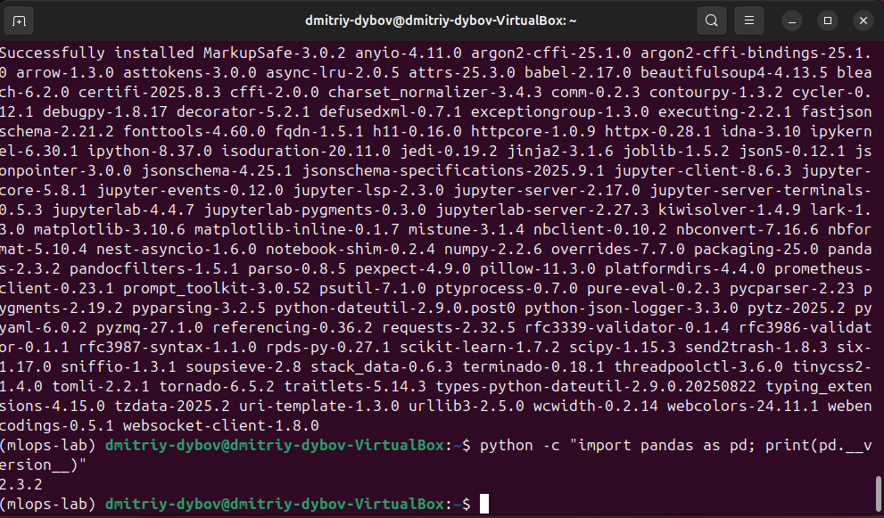
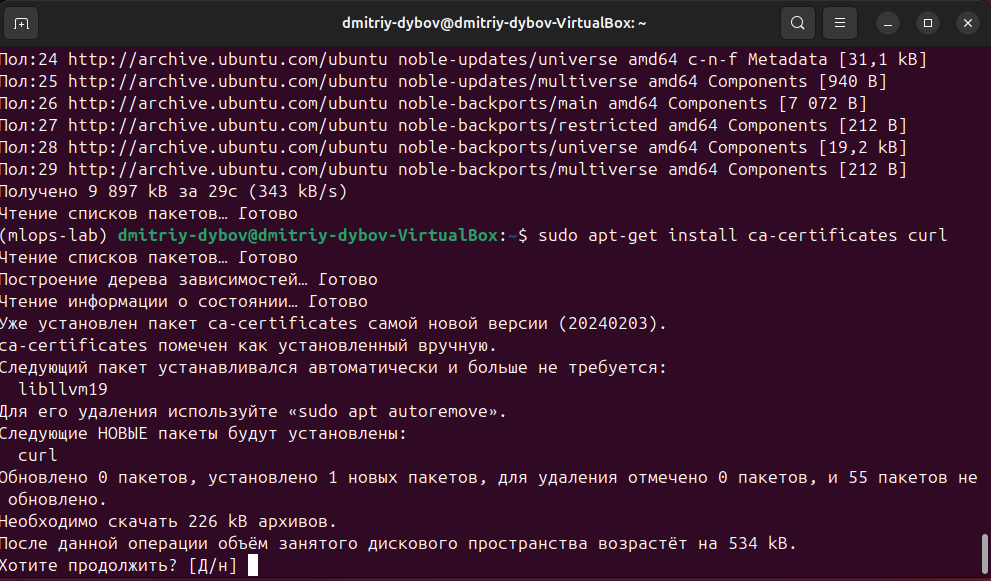
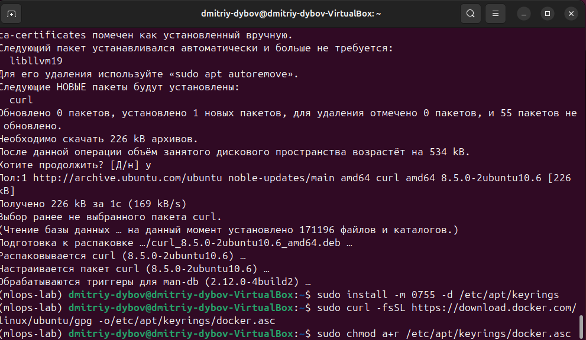
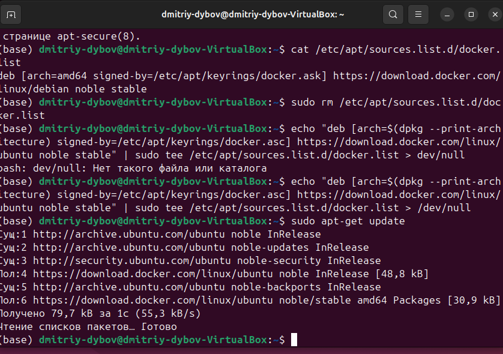
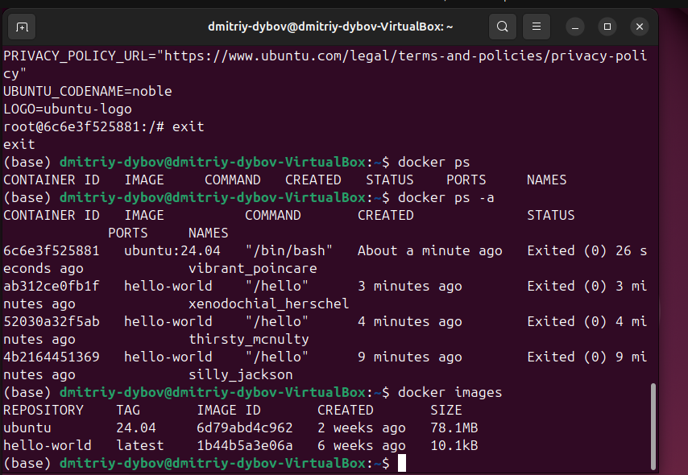
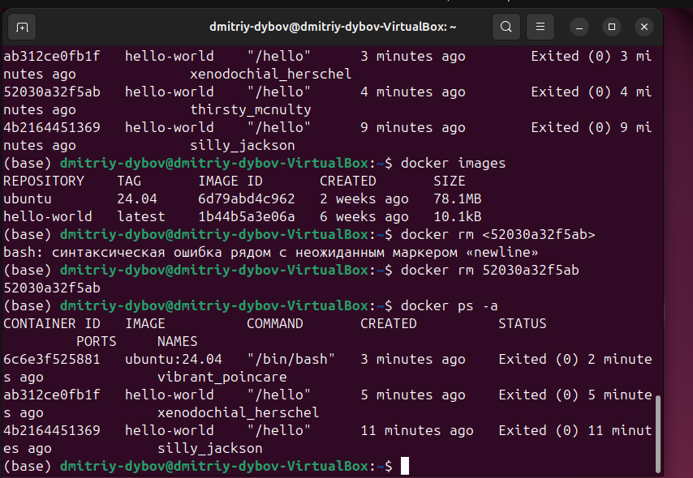
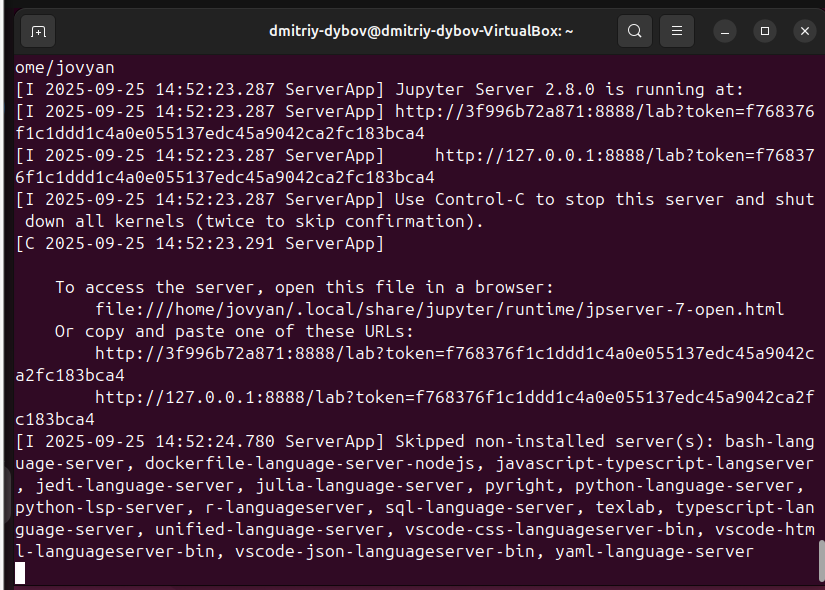

# МИНИCTEPCTBO НАУКИ И ВЫСШЕГО ОБРАЗОВАНИЯ РОССИЙСКОЙ ФЕДЕРАЦИИ 
## Федеральное государственное автономное образовательное учреждение высшего образования «Северо-Кавказский федеральный университет» Департамент цифровых, робототехнических систем и электроники института перспективной инженерии

### Отчет по лабораторной работе 1
### Подготовка рабочего окружения для MLOps и основы трекинга экспериментов с использованием MLflow
Дата: 2025-11-14 \
Семестр: [2 курс 1 полугодие - 3 семестр] \
Группа: ПИН-м-о-24-1 \
Дисциплина: Технологии программирования \
Студент: Дыбов Д.В. 

#### Цель работы
Освоение базовых принципов установки и настройки рабочего окружения для Data Science и MLOps на базе Anaconda (conda) и Docker; получение практических навыков управления виртуальными окружениями Python, работы с conda.

#### Теоретическая часть
Краткие изученные концепции:
- Виртуальные окружения Python (Miniconda/conda): зачем нужны, создание и активация окружения, установка зависимостей.
- Docker: образы, контейнеры, репозитории, работа без sudo через группу docker.
- JupyterLab в контейнере: запуск и взаимодействие через браузер.

#### Практическая часть
##### Выполненные задачи
- [x] Задача 1: Установить Ubuntu 24.04.03 LTS в VirtualBox и подготовить среду для Docker.
- [x] Задача 2: Установить Miniconda, создать и активировать виртуальное окружение mlops-lab.
- [x] Задача 3: Установить пакеты pandas, scikit-learn, matplotlib, jupyterlab и проверить импорт.
- [x] Задача 4: Установить Docker Engine: добавить GPG-ключ, настроить репозиторий, установить engine.
- [x] Задача 5: Запустить тестовый Docker-образ и обучиться базовым командам: ps, ps -a, images, rm.
- [x] Задача 6: Запустить JupyterLab в Docker-контейнере и проверить доступ по http://127.0.0.1:9000.
- [x] Установить mlflow, запустить MLflow Tracking Server.
- [x] Создать и запустить скрипт mlflow_basic.py, проверить появление эксперимента, логирование метрик и артефактов, повторить запуски с разными параметрами.
    
##### Создание и активация окружения conda
conda create -n mlops-lab python=3.10 -y
conda activate mlops-lab

##### Установка зависимостей
conda install pandas scikit-learn matplotlib jupyterlab -y
pip install mlflow

##### Базовые docker-команды
sudo apt-get update

##### Добавить GPG ключ и репозиторий Docker (прим. команды)
curl -fsSL https://download.docker.com/linux/ubuntu/gpg | sudo gpg --dearmor -o /usr/share/keyrings/docker-archive-keyring.gpg

##### Установка Docker Engine
sudo apt-get update
sudo apt-get install docker-ce docker-ce-cli containerd.io -y

##### Добавить пользователя в группу docker
sudo usermod -aG docker $USER

##### Запуск JupyterLab в контейнере (пример)
docker run -p 9999:8888 jupyter/base-notebook

##### Результаты выполнения
1. Создано и активировано окружение mlops-lab. \
 \
Рисунок 1 - Создание виртуального окружения \

 \
Рисунок 2 – Активация виртуального окружения \

2. Установлены пакеты pandas, scikit-learn, matplotlib, jupyterlab — импорт pandas прошёл успешно. \
 \
Рисунок 3 – Установка необходимых пакетов и проверка их работоспособности \

3. Docker установлен и проверен запуском тестового образа (контейнер вывел "Hello from Docker!" / успешное сообщение запуска) \
 \
Рисунок 4 – Обновление индексов пакетов и установка нужных зависимостей \
 \
Рисунок 5 – Добавление GPG-ключа Docker /
 \
Рисунок 6 – Настройка репозитория /
 \
Рисунок 7 – Установка Docker Engine /
 \
Рисунок 8 – Запуск тестового образа с сообщением об успешной установке \

4. Пользователь добавлен в группу docker — запуск docker без sudo подтверждён. \
 \
Рисунок 9 – Добавление пользователя в группу docker \

5. Запущен контейнер ubuntu:24.04 в интерактивном режиме, выполнены команды ls / и cat /etc/os-release — информация об ОС подтверждена. \
 \
Рисунок 10 – Запуск образа ubuntu:24.04 и проба команд \

6. Просмотр контейнеров: docker ps и docker ps -a; просмотр образов: docker images; удаление контейнера: docker rm <id> — отработало корректно. \
 \
Рисунок 11 – Просмотр всех контейнеров /
 \
Рисунок 12 – Список образов /
 \
Рисунок 13 – Удаление контейнера /

7. JupyterLab запущен в контейнере, доступен по адресу http://127.0.0.1:9999; в ноутбуке выполнён тестовый код. \
 \
Рисунок 14 – Запуск JypyterLab \
 \
Рисунок 15 – Успешное выполнение кода /
 \
Рисунок 16 – Остановка контейнера \

#### Тестирование
- [x] Модульные тесты - не применялись (задача лабораторная, проверка окружения).
- [x] Интеграционные тесты - проверены интеграции: conda environment ↔ Docker контейнеры ↔ JupyterLab ↔ MLflow Tracking.
- [x] Производительность - не в фокусе данной работы; операции по установке и запуску прошли в пределах ожидаемого времени.

#### Приложения
Ключевые команды установки и проверки .

Отчёт о результатах в MLflow UI: созданный эксперимент, список запусков, подробности запуска (params/metrics), вкладка Artifacts с сохранённым графиком.

#### Выводы
Рабочее окружение для MLOps было успешно подготовлено: настроены conda-окружение и Docker.
JupyterLab и MLflow корректно запущены внутри/взаимодействуют с Docker-контейнерами; эксперименты логируются и визуализируются в MLflow UI.
Получены практические навыки управления окружениями, установки зависимостей, базовой работы с Docker и трекинга экспериментов (логирование параметров, метрик и артефактов).

